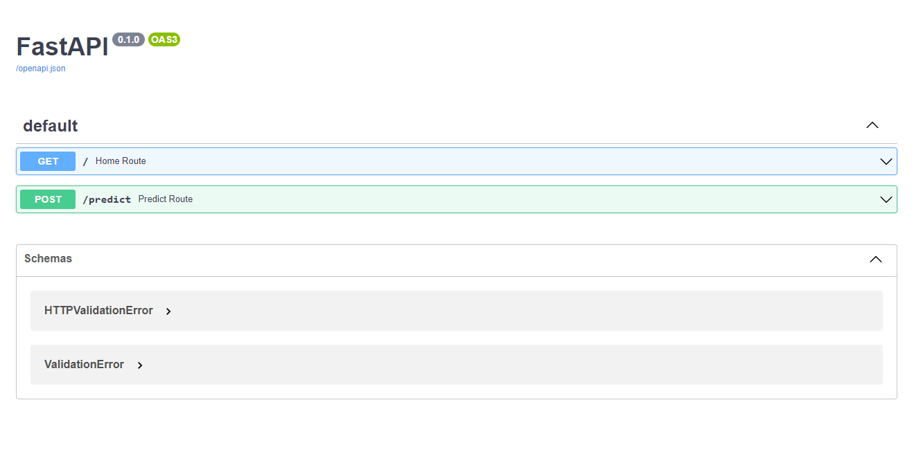
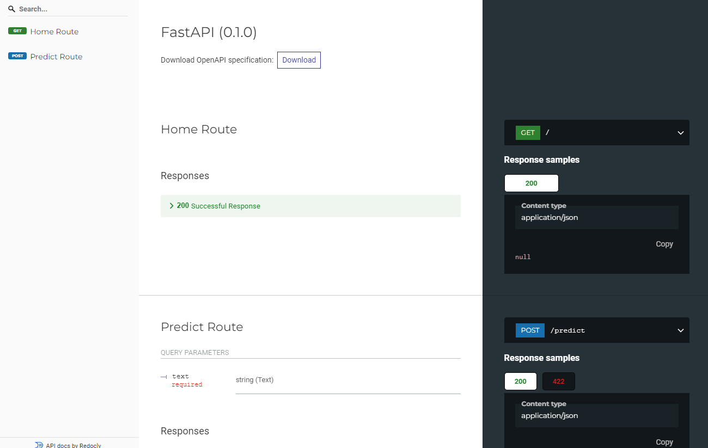

# Getting Started with the Backend of the Project

Here we are building a backend which is integrated to our ML Model which we have created in the `Pickel File Generation` folder

Move the `.pickel` file outside the `Pickel File Generation` folder 

```bash
cd '.\python-backend\Pickel File Generation\'
mv TwitterSentimentModel ../
```

## Now set up a virtual enviroment in python
Setting up the virtual enviroment using `venv` , activating the enviroment and installing all the required packages from the `requirements.txt` 

To run this project you need to install `vader_lexicon` which is present in the `nltk` using the `nltk.downloader`

```bash
python -m venv myenv

myenv\Scripts\activate

pip install -r requirements.txt

python -m nltk.downloader vader_lexicon
```

## Lets Run the Backend app
To run the Backend:
```bash
uvicorn main:app --reload
# or
python -m uvicorn main:app --reload
```
Open [http://localhost:8000](http://localhost:8000) with your browser to see the result like this 
```json
{
  "message": "Your backend server is up and running...",
  "success": true
}
```

In order to check all the API's visit [http://localhost:8000/docs](http://localhost:8000/docs) to see a interface like this 



There is a another way of viswalizing the API's visit [http://localhost:8000/redoc](http://localhost:8000/redoc) to see a interface like this 

